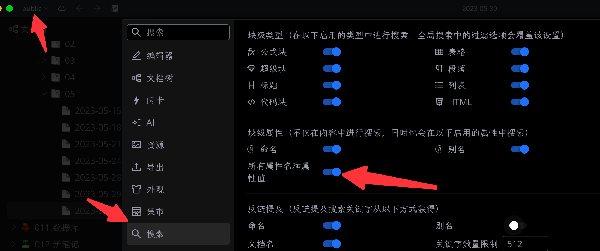

[中文](README_zh_CN.md)

# siyuan-plugin-custom-slug

I heard give me a new name, it will be easier for you to find me ☺️

## Core Features
- **Auto Alias**: Generate three by default, English, Pinyin and Pinyin initials
  - 1 Automatically generate an alias of `English translation` + `hash` and save it in `name` and `custom-slug` attributes.
  - 2 Automatically generate the alias of `pinyin` + `hash` and save it in the `alias` property.
  - 2 Automatically generate an alias of `Pinyin initials` + `hash` and save it in the `alias` property.

  Note 1: An additional `custom-slug` key is saved for compatibility with the `siyuan-plugin-publisher` plugin.

  Note 2: The purpose of hash is to prevent duplicate aliases of two documents. Just like in reality, if you call two people with the same name, who will agree, haha, right?

- **Support viewing**: In the right-click menu, you can view and modify the naming and alias of the current setting

## FAQ

* Q1: What is the origin of this plugin?

  A1: Refer to [Automatically add pinyin as aliases to new files](https://github.com/siyuan-note/siyuan/issues/8396). If the alias is automatically generated, after the alias search is enabled, the efficiency can be greatly improved. Because, you think, typing an English character or pinyin must be faster than Chinese characters, right?

* Q2: Can it be automatically generated when creating a new document?

  A2: This cannot be done temporarily. Moreover, there may be users who don't want to generate every document. So provide the top bar button, click to generate automatically.

* Q3: Why can't the automatically generated key be changed?

  A3: This is for compatibility with subsequent publishing tools, and this key is actually only concerned by developers. Ordinary users have no obvious perception, it is just a convention. Of course, if there is a strong demand for changes, subsequent versions may also consider supporting custom named keys. Note: The key of non-custom attribute cannot be modified.

* Q4: How to enable alias search?

  A4: Go to `Settings` -> `Search`, you can find the switch to enable alias search, you can choose naming, alias and custom attributes.

  

## Changelog

**v0.0.2 major update**

### Features
- Add some international resources ([b61cfad](https://github.com/terwer/siyuan-plugin-custom-slug/commit/b61cfad795185878e7ec7ca55e158e32d8934de0))
- Adjust preview image and icon size ([f219a40](https://github.com/terwer/siyuan-plugin-custom-slug/commit/f219a40cbf6f15ecc8bee3c996d352ae83699124))
### Refactoring
- Fix build error ([a8ea298](https://github.com/terwer/siyuan-plugin-custom-slug/commit/a8ea2988bffbf0372b1c90b885248c1af9afcc39))

**v0.0.1 major update**

- first version

For more update records, please check [CHANGELOG](https://github.com/terwer/siyuan-plugin-custom-slug/blob/main/CHANGELOG.md)

## Donate

If you approve of this project, invite me to have a cup of coffee, which will encourage me to keep updating and create
more useful tools~

### Wechat

### Alipay

## Thanks

Thanks to [frostime](https://github.com/siyuan-note/plugin-sample-vite-svelte) for the project template