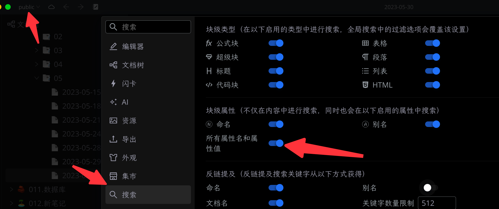

[English](README.md)

# 文档别名

听说给我起个新名字，你更容易找到我☺️

## 核心特色

- **自动别名**：默认生成三个，英文、拼音和拼音首字母
  - 1 自动生成 `英文翻译` + `hash` 的别名，保存到 `name` 和 `custom-slug` 属性中。
  - 2 自动生成 `pinyin` + `hash` 的别名，保存到 `alias` 属性中。
  - 2 自动生成 `拼音首字母` + `hash` 的别名，保存到 `alias` 属性中。
  
  注1：额外保存一个 `custom-slug` 这个key，是为了与发布工具插件兼容。

  注2：hash 的目的是防止两篇文档别名重复。就像现实中你喊两个名字一样的人，谁答应好呢，哈哈，是吧

- **支持查看**：在右键菜单中，可查看并修改当前设置的命名和别名

## FAQ

* Q1：做这个插件的缘起是什么？

  A1：参考 [新建文件自动加入拼音做别名](https://github.com/siyuan-note/siyuan/issues/8396) 。如果自动生成了别名，在开启别名搜索之后，可以大大的提升效率。因为，你想啊，打一个英文字符或者拼音，肯定比汉字来得快吧是吧。

* Q2：新建文档时候能自动生成吗？

  A2：这个暂时做不到。而且，或许也有用户不想每篇文档都生成呢。所以提供顶栏按钮，点击自动生成。

* Q3：自动生成的 key 为什么不能改？

  A3：这个是为了和后续的发布工具兼容，而且这个 key 其实只是开发者关心的，普通用户并无明显感知，只是一个约定而已。当然，如果强烈要求改的话，后续版本也可考虑支持自定义命名 key 。注意：非自定义属性的 key 不可修改。

* Q4：怎么开启别名搜索？

  A4：到 `设置` -> `搜索` 里面，可以找到开启别名搜索的开关，您可以选择命名、别名以及自定义属性。

  

## 更新历史

**v0.0.1 主要更新**

- 第一个版本

更多更新记录请查看 [CHANGELOG](https://github.com/terwer/siyuan-plugin-custom-slug/blob/main/CHANGELOG.md)

## TODO

**v0.0.2 TODO**

- [ ] 部分资源国际化

## 捐赠

如果您认可这个项目，请我喝一杯咖啡吧，这将鼓励我持续更新，并创作出更多好用的工具~

### 微信

### 支付宝

## 感谢

感谢 [frostime](https://github.com/siyuan-note/plugin-sample-vite-svelte) 提供的项目模板